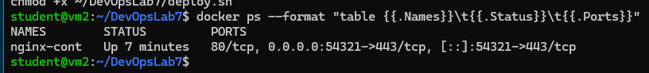
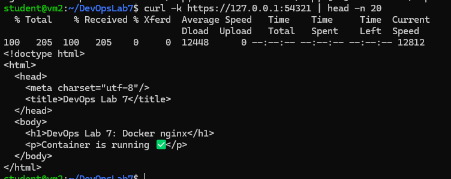
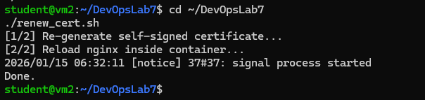

# DevOps Lab 7 — Docker basics (Nginx + HTTPS)

**Демидов Матвей Александрович, ФИТ-1-2024 НМ**  
**Дисциплина:** Методы и инструменты DevOps  
**Лабораторная работа:** ЛР по лекции 7 (Docker basics)

---

## 1) Задание (основная часть)
- Создать Docker-образ с **Nginx**
- Отдавать статическую HTML-страницу
- Для доступа снаружи пробросить порт **54321** в контейнер
- Команду запуска контейнера оформить shell-скриптом

---

## 2) Дополнительное задание (HTTPS)
- Сгенерировать SSL-сертификат
- Запустить nginx в контейнере по **HTTPS**
- Сертификат пробросить в контейнер через **Volume Mapping**
- Сделать скрипт обновления сертификата (пересоздания) и команду `nginx reload`

---

## 3) Стенд
- **VM2 (Docker host):** `10.0.2.16`  
  SSH из Windows: `ssh student@127.0.0.1 -p 2223`

---

## 4) Структура проекта
```
.
├─ deploy.sh
├─ renew_cert.sh
├─ certs
│  ├─ server.crt
│  └─ server.key
└─ nginx
   ├─ dockerfile
   ├─ index.html
   └─ nginx-conf
      └─ nginx.conf
```

---

## 5) Основные команды (VM2)

### 5.1 Сборка образа
```bash
cd ~/DevOpsLab7
docker build -t nginx-server ./nginx -f ./nginx/dockerfile
```

### 5.2 Запуск контейнера (HTTPS) с volume mapping сертификатов
```bash
docker rm -f nginx-cont 2>/dev/null || true

docker run -d --name nginx-cont   -p 54321:443   -v ~/DevOpsLab7/certs:/etc/nginx/certs:ro   --restart unless-stopped   nginx-server
```

### 5.3 Проверка
```bash
docker ps --format "table {{.Names}}\t{{.Status}}\t{{.Ports}}"
curl -k https://127.0.0.1:54321 | head -n 20
```

---

## 6) Скрипты

### 6.1 deploy.sh
Собирает образ и запускает контейнер с HTTPS:
```bash
cd ~/DevOpsLab7
./deploy.sh
```

### 6.2 renew_cert.sh
Пересоздаёт сертификат на хосте и выполняет `nginx -s reload` в контейнере:
```bash
cd ~/DevOpsLab7
./renew_cert.sh
```

---

## 7) Скриншоты

### 7.1 Build образа


### 7.2 Запущенный контейнер (порт 54321)


### 7.3 Проверка страницы через curl


### 7.4 Проверка в браузере (опционально)


### 7.5 HTTPS: docker ps (54321 → 443)


### 7.6 HTTPS: curl -k (страница отдаётся по https)


### 7.7 Обновление сертификата + nginx reload

