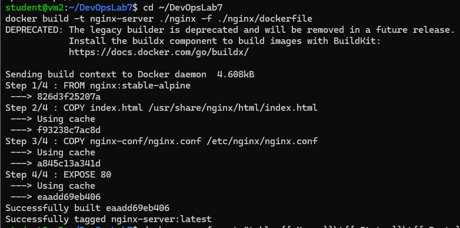
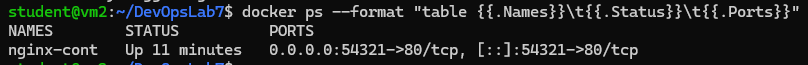
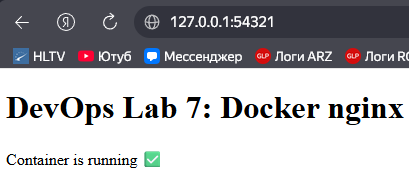

# DevOps Lab 7 — Docker basics (Nginx container)

**Демидов Матвей Александрович, ФИТ-1-2024 НМ**  
**Дисциплина:** Методы и инструменты DevOps  
**Лабораторная работа:** ЛР по лекции 7 (Docker basics)

---

## 1) Задание (основная часть)
Собрать образ и запустить контейнер:
- внутри которого работает web-сервер **Nginx**
- отдающий статическую **HTML** страницу с приветствием
- для доступа снаружи пробросить порт **54321** в контейнер (mapping `54321:80`)
- команду запуска контейнера оформить **shell-скриптом**

---

## 2) Что сделано
- Установлен Docker на VM2
- Создан Docker-образ `nginx-server` на базе `nginx:stable-alpine`
- Добавлены файлы:
  - `index.html` — страница приветствия
  - `nginx.conf` — конфиг nginx внутри контейнера
- Запущен контейнер `nginx-cont` с пробросом порта `54321:80`
- Добавлен скрипт `deploy.sh` для сборки и запуска в 1 команду
- Выполнены проверки через `docker ps` и `curl`

---

## 3) Стенд
- **VM2 (Docker host):** `10.0.2.16`  
  SSH из Windows: `ssh student@127.0.0.1 -p 2223`

Проверка доступа:
- на VM2: `curl http://127.0.0.1:54321`
- (опционально) на Windows: `http://127.0.0.1:54321` (если добавлен проброс порта VirtualBox)

---

## 4) Структура проекта
```
.
├─ deploy.sh
├─ nginx
│  ├─ dockerfile
│  ├─ index.html
│  └─ nginx-conf
│     └─ nginx.conf
├─ build.log
├─ ps.log
├─ curl.log
├─ container_logs.log
└─ deploy_run.log
```

---

## 5) Основные команды (VM2)

### 5.1 Сборка образа
```bash
cd ~/DevOpsLab7
docker build -t nginx-server ./nginx -f ./nginx/dockerfile
```

**Ожидаемо:** в конце сборки — `Successfully tagged nginx-server:latest`.

### 5.2 Запуск контейнера с пробросом порта 54321
```bash
docker rm -f nginx-cont 2>/dev/null || true
docker run -d --name nginx-cont -p 54321:80 --restart unless-stopped nginx-server
```

### 5.3 Проверка контейнера
```bash
docker ps --format "table {{.Names}}\t{{.Status}}\t{{.Ports}}"
```

**Ожидаемо:** порт вида `0.0.0.0:54321->80/tcp` и статус `Up`.

### 5.4 Проверка страницы
```bash
curl -s http://127.0.0.1:54321 | head -n 20
```

**Ожидаемо:** в HTML есть текст `DevOps Lab 7`.

---

## 6) Скрипт деплоя
Запуск в 1 команду:
```bash
cd ~/DevOpsLab7
./deploy.sh
```

**Ожидаемо:** скрипт выполнит build + run и выведет таблицу `docker ps`, а также подсказку URL.

---

## 7) Скриншоты (что должно быть видно)

### 7.1 Build образа
Файл: `screenshots/01_docker_build.png`  
**На скрине видно:** команда `docker build ...` и успешное завершение (`Successfully tagged ...`).



### 7.2 Запущенный контейнер и проброс порта
Файл: `screenshots/02_docker_ps_ports.png`  
**На скрине видно:** `nginx-cont`, статус `Up`, проброс `54321->80/tcp`.



### 7.3 Проверка через curl
Файл: `screenshots/03_curl_ok.png`  
**На скрине видно:** HTML (заголовок/текст) со строкой `DevOps Lab 7`.


### 7.4 Проверка в браузере (опционально)
Файл: `screenshots/04_browser_ok.png`  
**На скрине видно:** адрес `127.0.0.1:54321` и страница из контейнера.



---

## 8) Дополнительное задание (SSL/HTTPS)
В методичке есть доп.пункты:
- сгенерировать SSL сертификат
- поднять nginx в контейнере по HTTPS
- пробросить сертификат через Volume Mapping
- сделать скрипт обновления сертификата и `nginx reload`

**Статус:** выполняется **только если преподаватель требует доп.задание**.  
Если нужно — сделаем это отдельно (это будет версия “Lab7 + HTTPS”).
